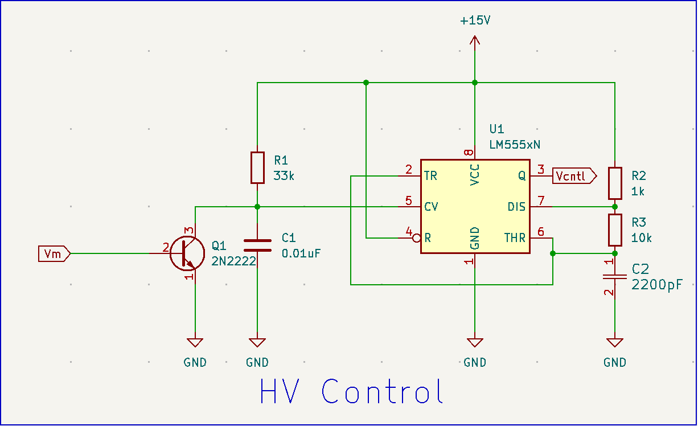
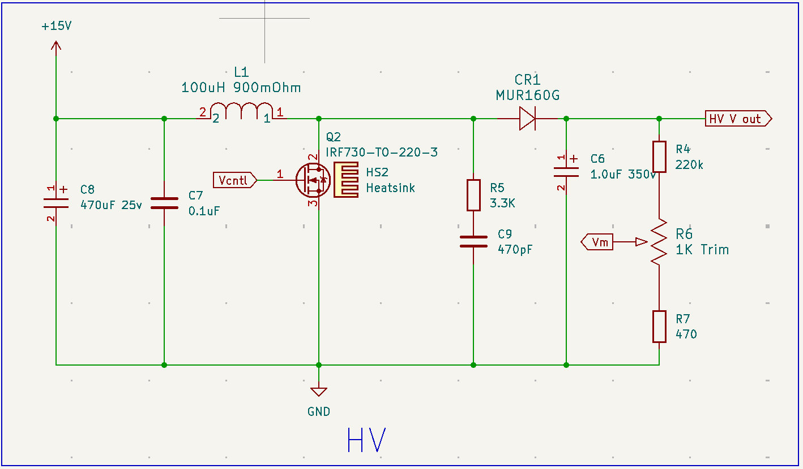
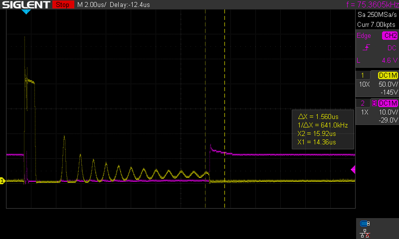
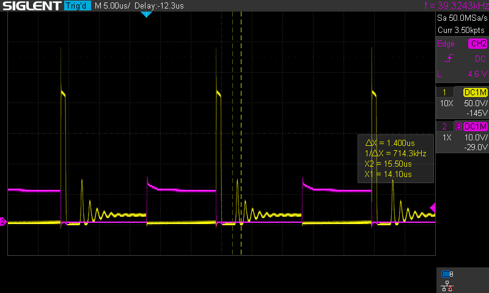
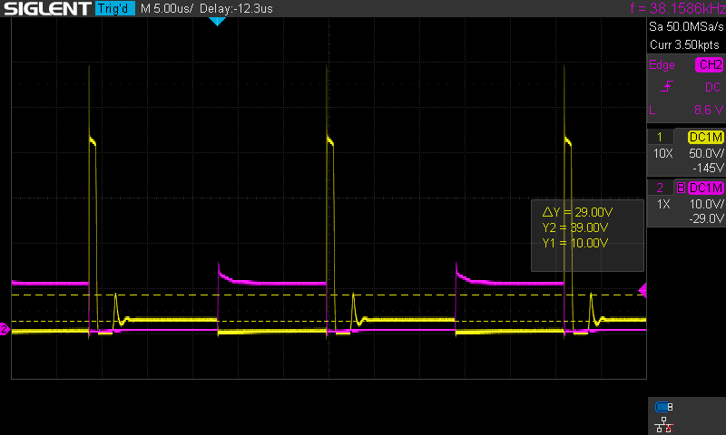
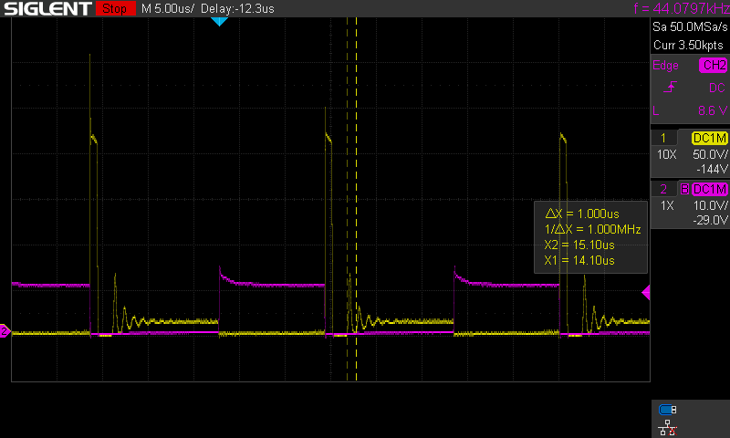
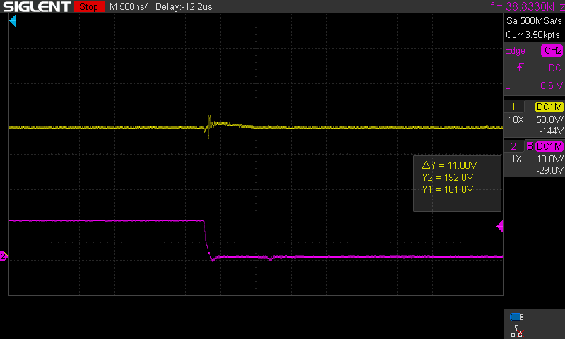

# 555 HV Power supply for Nixie tubes

This is a power supply for nixie tubes based on the 555 timer chip. The 555 is configured in its astable mode with a frequency of ~32kHz.

When I used this, it has some ripple in the output and there is some slight ghosting of the digits that I think is from noise affecting the serial output to the nixie 3.2 driver board. When I use a commercial supply that has cleaner output, there is no ghosting. However, it might be that noise from my breadboard version of the HV PS is the problem and not the output itself.

## About the RC snubber

R5 and C9 are a RC snubber to limit ringing at the from Q2 when it switches off. 
In these images, yellow is the hig voltage at the inductor-diode-Q2 junction or the
HV output of the PS and magenta is the switching voltage from pin 3 of the 555 (i.e.,
the gate of Q2).

Without the RC snubber, there is ringing when Q2 turns off:

The snubber circuit can damp this ringing - that might help clean up the output.
Here are the effects of various values of R5 and C9. I choose R5 at 15k and C9
as 100pF initially based on info from [DigiKey's article on RC snubbers for power switches](https://www.digikey.com/en/articles/resistor-capacitor-rc-snubber-design-for-power-switches).

Some improvement.

Dropping R5 down to 1K makes a bigger difference, but the efficiency of the PS
drops (the current draw goes from 370mA to 400mA):

Increasing C9 to 470pF makes an even bigger improvement, but the PS is still drawing 400mA
@12V from the bench supply:

Increasing R5 to 3.3K reduces the power needed (back to 370mA @12V) with decent damping:

The output of the PS looks like:

